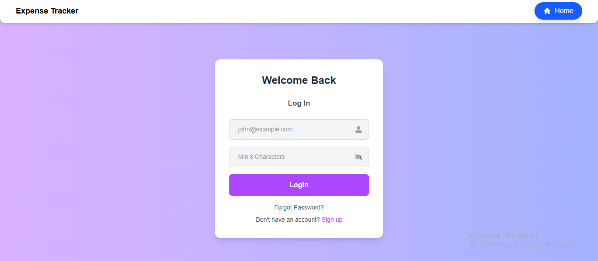
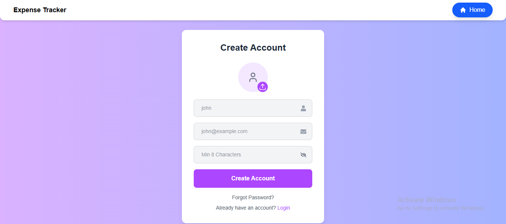
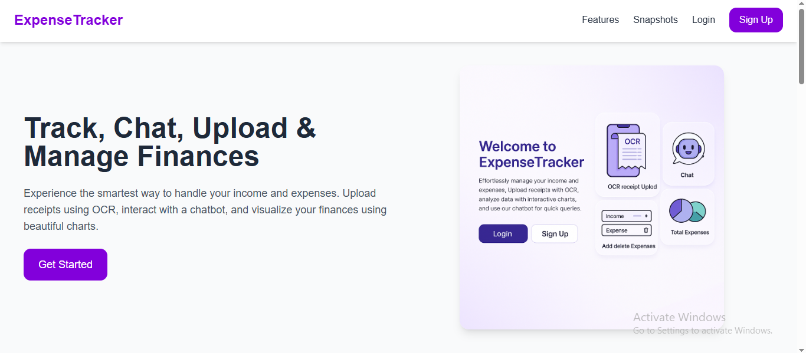
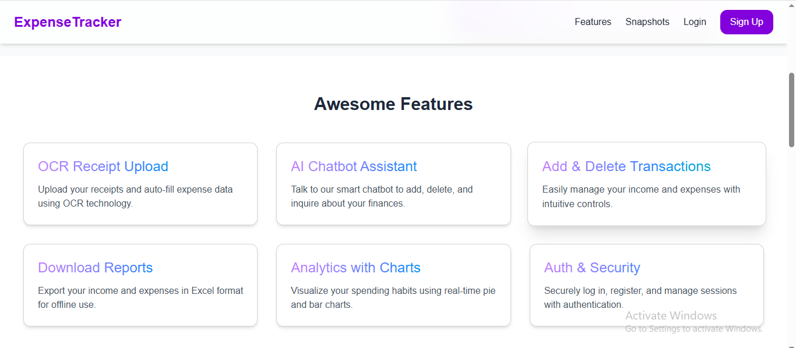
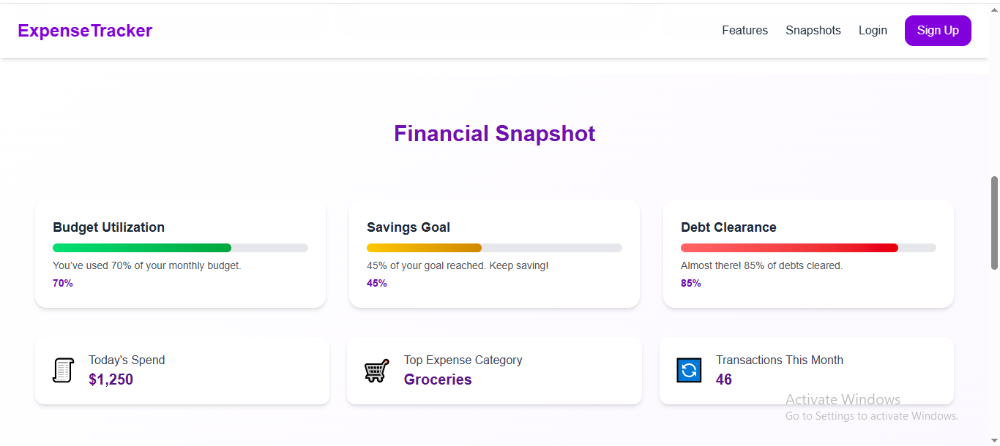
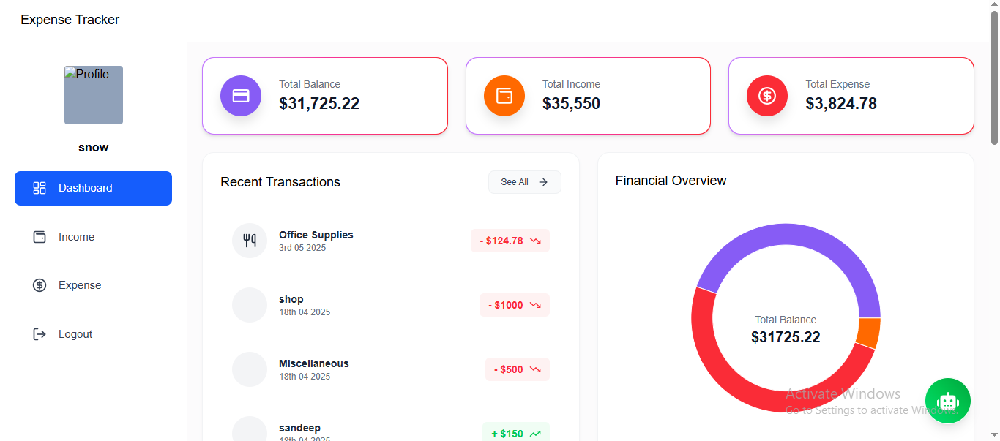
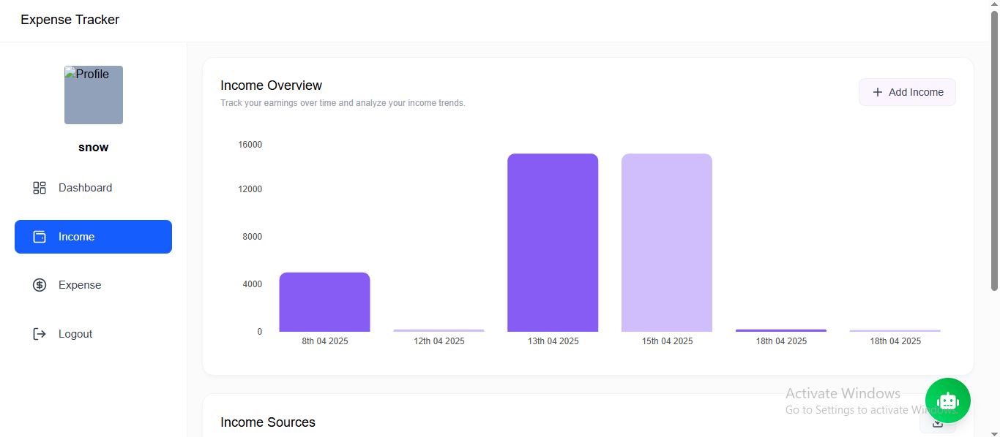
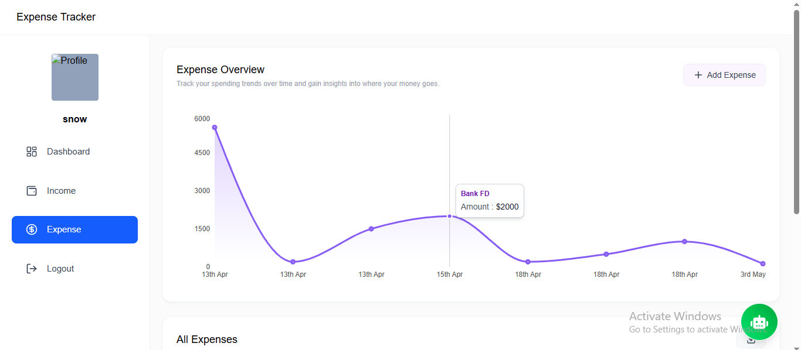
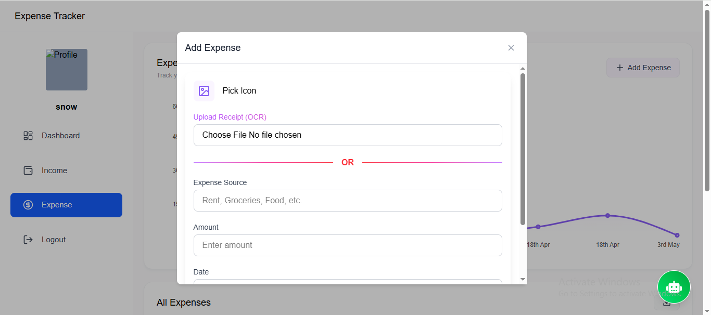

# React + Vite

This template provides a minimal setup to get React working in Vite with HMR and some ESLint rules.

Currently, two official plugins are available:

- [@vitejs/plugin-react](https://github.com/vitejs/vite-plugin-react/blob/main/packages/plugin-react) uses [Babel](https://babeljs.io/) for Fast Refresh
- [@vitejs/plugin-react-swc](https://github.com/vitejs/vite-plugin-react/blob/main/packages/plugin-react-swc) uses [SWC](https://swc.rs/) for Fast Refresh

## Expanding the ESLint configuration

If you are developing a production application, we recommend using TypeScript with type-aware lint rules enabled. Check out the [TS template](https://github.com/vitejs/vite/tree/main/packages/create-vite/template-react-ts) for information on how to integrate TypeScript and [`typescript-eslint`](https://typescript-eslint.io) in your project.


# 📊 Expense Tracker (MERN Stack)

A modern full-stack Expense Tracker application built using the MERN stack (MongoDB, Express, React, Node.js). This app helps users manage their finances by tracking income and expenses, with smart features like OCR receipt scanning and AI chat support.

---

## 🚀 Features

- 🔐 User Authentication (Login/Signup)
- 📈 Dashboard with Total Income, Expenses, and Balance
- 📊 Graphical Reports using Recharts
- 🤖 AI Chatbot 
- 📸 OCR Receipt Scanner using Tesseract.js
- 📅 Date-wise Transaction Filtering
- 📥 Download Transactions as Excel
- 🌈 Modern UI with Tailwind CSS & Framer Motion

---

## 🛠️ Tech Stack

**Frontend:**
- React 19
- Tailwind CSS 4
- Recharts
- Framer Motion
- React Router DOM 7
- React Icons
- Emoji Picker
- React Speech Recognition

**Backend:**
- Node.js
- Express.js
- MongoDB
- Multer (for image uploads)
- OpenAI API

**Tools:**
- Axios
- Vite
- ESLint

---

## 📸 Screenshots

### Login Page


### Sign Up Page


### Home Page


### Awesome Features


### Financial SnapShots


### Dashboard


### Income


### Expense


### OCR Receipt Upload


---

## 🧪 Installation & Setup (Local)

### 1. Clone the Repository
```bash
git clone https://github.com/your-username/expense-tracker.git
cd expense-tracker
```

### 2. Install Dependencies
```bash
npm install
```

### 3. Setup Environment Variables
Create a `.env` file in the root and add:
```env
MONGO_URI=your_mongodb_uri
OPENAI_API_KEY=your_openai_api_key
```

### 4. Start the Development Server
```bash
npm run dev
```

- Frontend: `http://localhost:5173`
- Backend (if separated): `http://localhost:5000`

---

## 🌐 Deployment

### Frontend (Vercel)
1. Push your code to GitHub
2. Import project on [Vercel](https://vercel.com/)
3. Set Environment Variables in settings
4. Deploy

### Backend (Render/Railway/Heroku)
1. Push backend code to GitHub
2. Create new web service in Render/Railway
3. Set environment variables
4. Deploy

---

## 🤝 Contributing

Feel free to fork this repository, raise issues or submit PRs.

---

## 📄 License

This project is licensed under the MIT License - see the [LICENSE](LICENSE) file for details.

---

## 📬 Contact

If you have any questions or suggestions, feel free to reach out:
- Email: sandeeprajput88066@gmail.com
- LinkedIn: [Sandeep Rajput](https://www.linkedin.com/in/sandeep-rajput-ab2a40284/  )

---

> Built with ❤️ using MERN Stack

